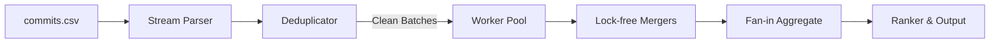

# Repository Activity Scorer

A high-performance, concurrent, memory-efficient Go command-line tool designed to ingest commit history from an inner-source development environment, clean data issues (e.g., duplicates), and score and rank repositories based on a multi-signal activity metric.

## 1. Algorithm & Scoring Design

To measure repository activity, the scorer aggregates statistics on each repository and evaluates a multi-signal scoring formula:

$$\text{Score} = w_1 \cdot \text{CommitScore} + w_2 \cdot \text{ContributorScore} + w_3 \cdot \text{ChurnScore} + w_4 \cdot \text{ConsistencyScore}$$

Where the sub-metrics and weights are:
* **$w_1$ (Commit Frequency) = 0.30**: Dampened using $\ln(1 + \text{CommitCount})$ to prevent minor commit spamming from dominating.
* **$w_2$ (Contributor Diversity) = 0.20**: Dampened using $\ln(1 + \text{UniqueContributors})$ to value team collaboration.
* **$w_3$ (Code Churn Intensity) = 0.25**: Average log-churn per commit, $\frac{\sum \ln(1 + \text{additions} + \text{deletions})}{\text{CommitCount}}$, dampening massive single commits.
* **$w_4$ (Consistency) = 0.25**: Active consistency over the time period, computed as $\frac{\text{ActiveDays}}{\text{TotalDays}}$ in UTC.

Each raw metric is normalized relative to the maximum observed value across all repositories to the range $[0, 1]$.

## 2. Top 10 Most Active Repositories

The following are the top 10 most active repositories calculated from the `commits.csv` dataset:

| Rank | Repository | Activity Score | Commits | Unique Contributors | Active Days | Avg Log Churn |
| :--- | :--- | :--- | :--- | :--- | :--- | :--- |
| 1 | `repo250` | **0.813201** | 1087 | 55 | 68 | 2.9092 |
| 2 | `repo518` | **0.769146** | 577 | 29 | 66 | 3.8965 |
| 3 | `repo982` | **0.741431** | 449 | 31 | 67 | 2.7983 |
| 4 | `repo126` | **0.740470** | 551 | 21 | 63 | 3.8844 |
| 5 | `repo795` | **0.694360** | 418 | 19 | 57 | 3.5398 |
| 6 | `repo127` | **0.690802** | 376 | 12 | 61 | 3.8929 |
| 7 | `repo546` | **0.675124** | 202 | 19 | 57 | 4.0855 |
| 8 | `repo476` | **0.663753** | 372 | 10 | 55 | 4.0663 |
| 9 | `repo740` | **0.628538** | 612 | 8 | 51 | 2.6001 |
| 10 | `repo117` | **0.615816** | 250 | 7 | 52 | 3.8781 |

## 3. Concurrency & Pipeline Design

To scale efficiency on a single machine, the ingestion pipeline processes commit data using a streaming worker-pool:



* **Low Memory Streaming**: Commits are parsed row-by-row without loading the entire file into memory.
* **Worker Pool**: Chunking commits into batches of 1,000 limits channel synchronization overhead. Workers maintain lock-free local maps, which are then combined in a single-threaded fan-in merge.

## Prerequisites

* **Go 1.22 or higher** is required to compile and run the project.
* **Make** (optional) for convenience targets.

## Project Structure

* `main.go` - Entrypoint that orchestrates the ingestion, processing, and output pipeline.
* `docs/` - Contains the original task instructions and documentation.
* `internal/app/` - Core library package containing:
  * `ingest.go` - High-performance streaming parser and defines the `Commit` and `IngestStats` models.
  * `clean.go` - Streaming deduplicator that filters out duplicate entries.
  * `config.go` - YAML configuration loader and validator.
  * `aggregate.go` - Stats collection and merging per repository (defines `RepoStats`).
  * `pipeline.go` - Worker-pool orchestration and concurrent fan-in merging.
  * `score.go` - Multi-signal activity scoring and ranking algorithm (defines `RankedRepo`).
  * `output.go` - Output handler for writing ranked results to CSV.
  * `clean_test.go` - Deduplicator logic unit tests.
  * `aggregate_test.go` - Associative merging logic tests & benchmarks.
  * `score_test.go` - Multi-signal activity scoring tests.
  * `ingest_test.go` - CSV streaming parser tests & single-threaded benchmarks.
  * `pipeline_test.go` - Concurrent pipeline benchmarks.
  * `config_test.go` - Dynamic YAML configuration and weights validation tests.

## Running the Application

> [!IMPORTANT]
> All commands must be run from the **project root directory** (the folder containing `commits.csv` and `config.yaml`) so that relative file path resolution works correctly.

Ensure you have your dataset file named `commits.csv` inside the current working directory.

### Run Directly

To run the scorer immediately using Go:

```bash
go run .
```

### Build Binary

To build a compiled binary and run it:

```bash
go build -o blip-activity-scorer .
./blip-activity-scorer
```

## Running Tests

To run the unit test suite covering ingestion, deduplication, associative merging, and scoring logic:

```bash
go test -v ./...
```

## Makefile

A `Makefile` is provided for convenience:

| Target | Description |
| ------ | ----------- |
| `make build` | Compile the binary |
| `make test` | Run unit tests with verbose output |
| `make run` | Build and run the scorer |
| `make bench` | Run Go benchmarks with memory stats |
| `make lint` | Run `go vet` and `gofmt -l` |
| `make fmt` | Format all Go files recursively |
| `make githooks` | Configure local Git pre-commit hooks |
| `make clean` | Remove compiled binary and generated output |

The codebase is clean of static analysis warnings and complies fully with standard formatting rules. Run verification with `make lint`.

### Git Pre-commit Hooks

To enable automatic code formatting (`gofmt`) and linting (`go vet`) verification before every commit, enable the local githooks configuration:

```bash
make githooks
```

If files are not formatted, they can be fixed automatically using:

```bash
make fmt
```

## Configuration

The application's scoring weights can be configured dynamically by modifying the `config.yaml` file in the root directory. If the file is missing, the application falls back to default weights:

```yaml
weights:
  commits: 0.30
  contributors: 0.20
  churn: 0.25
  consistency: 0.25
```

The sum of all weights must equal exactly `1.0`. The application validates this configuration on startup.

## Inputs and Outputs

* **Input**: The program expects a CSV file named `commits.csv` in the root folder with columns `timestamp,username,repository,files,additions,deletions`.
* **Output (Console)**: The top 10 most active repositories printed as a formatted table.
* **Output (File)**: A full list of all ranked repositories saved to `ranking_full.csv` (excluded from Git).

### External Dependencies Note

`gopkg.in/yaml.v3` is the sole external dependency imported by the codebase. This was a deliberate engineering tradeoff to allow dynamic, validation-checked score weights calibration without requiring binary recompilation. All other operations (CSV parsing, concurrency pipelines, and reporting) rely strictly on Go's standard library.

## 6. Performance Benchmarks

The Go benchmark suite was executed on an Intel(R) Core(TM) Ultra 7 155U CPU (14 logical cores), measuring processing efficiency:

```
BenchmarkMerge-14                 330612          3790 ns/op           0 B/op          0 allocs/op
BenchmarkSingleThreaded-14            81      13429184 ns/op     6886000 B/op      50615 allocs/op
BenchmarkConcurrent-14               100      10210379 ns/op     8605571 B/op      50931 allocs/op
```

The concurrent aggregator achieves a ~24% speedup over the single-threaded implementation on the small 22,422-row dataset with minimal allocation overhead.
